# Manual Tecnico
## Practica 1: Red Local

Este manual tecnico tiene como objetivo explicar el proceso de creación y configuracion de una red local pequeña utilizando el software Cisco Packet Tracer. 

### 1. Diseño de topologia tipo estrella
La red local estara compuesta por 2 switchs y un total de 22 computadoras o VPC. los switchs se conectaran entre si y cada computadora se conectara a un switch dependiendo de si esta en un área del nivel 1 o nivel 2 y sus distintas areas.
quedando de la siguiente manera:

Diseño del segundo nivel:

Diseño del primer nivel:

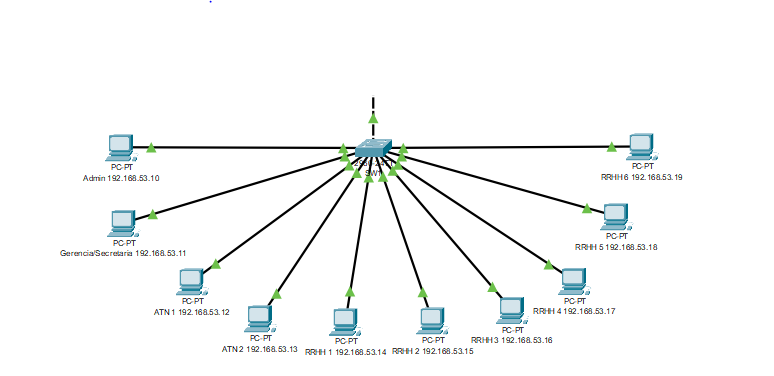

### 2. Configuración de los switchs
Para la configuración de los switchs se debe seguir los siguientes pasos:
1. agregamos una VPC y la conectamos a un switch con un cable de consola.
2. damos click en la VPC,seleccionamos el modo desktop y damos click en la terminal.
3. escribimos el comando `enable` y presionamos enter.
4. escribimos el comando `configure terminal` y presionamos enter.
5. escribimos el comando `hostname SW1` y presionamos enter.
6. escribimos el comando `no ip domain-lookup` y presionamos enter, esto evitara que el switch busque un servidor DNS para resolver nombres de dominio que no sean comandos.
7. escribimos el comando `enable secret <contraseña>` y presionamos enter, esto establece la contraseña de la cuenta privilegiada, esta es una configuración no requerida en esta practica pero es una buena practica de seguridad.
8. para guardar la configuración escribimos el comando `write memory` y presionamos enter.
9. para verificar las configuraciones escribimos el comando `show run` y presionamos enter.
10. escribimos el comando `exit` y presionamos enter para salir del modo de configuración.

Estos pasos se deben repetir para el switch 2, cambiando el nombre del switch a SW2.

a continuacion se muestran las capturas de pantalla de la configuración de los switchs:

### 3. Configuración de las computadoras
Para la configuración de las computadoras se debe seguir los siguientes pasos:
1. Ponemos una etiqueta para identificar cada computadora y saber a que area pertenece.
2. damos click en la computadora,seleccionamos el modo desktop y damos click en IP Configuration.
3. escribimos la direccion IP y la mascara de subred que corresponda a la computadora. El IP utilizado en esta practica es 192.168.53.1x, el 53 es practicamente los ultimos numeros de mi carnet y el x es el numero de la computadora o vpc.
4. hacemos lo mismo con todas las vpc.

a continuacion se muestran las capturas de pantalla de la configuración de las VPC:

- VPC área de administración:
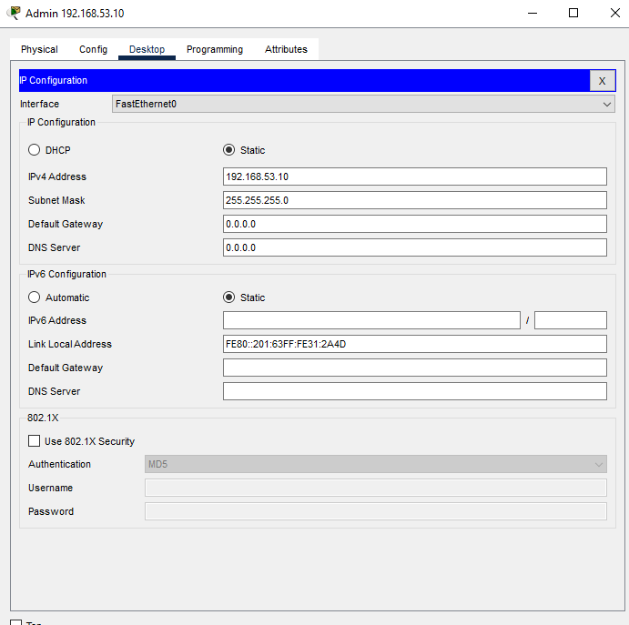

- VPC área de gerencia y secretaria:
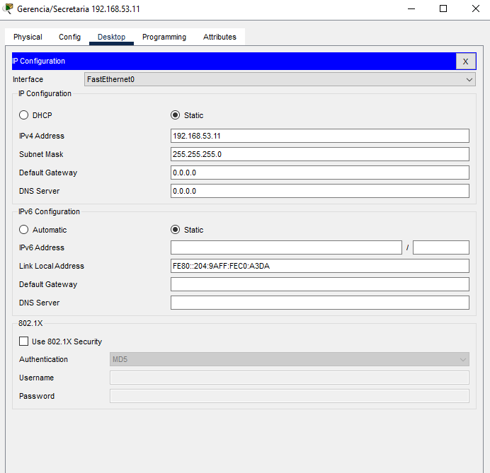

- VPC área de atención al cliente:
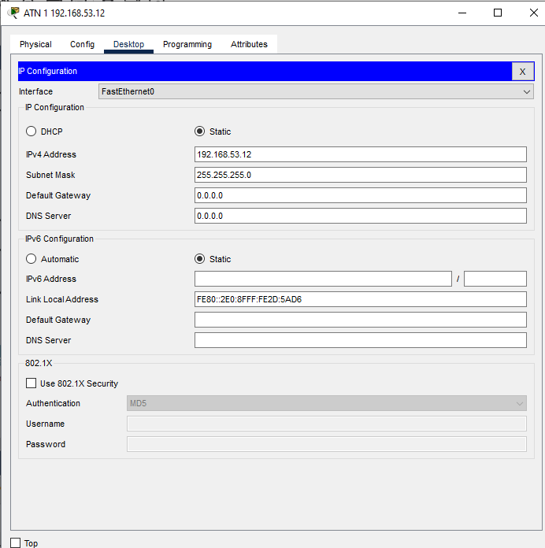

- VPC área de recursos humanos:
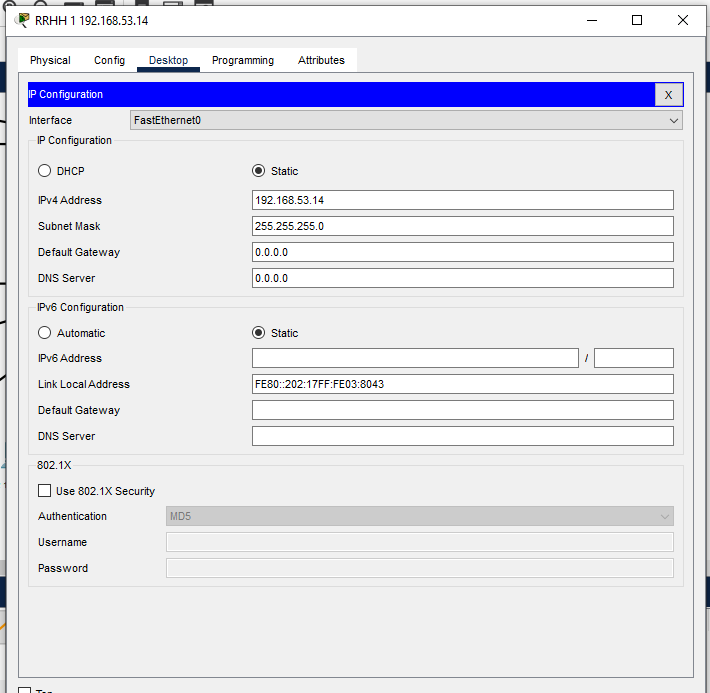

- VPC área de Ofcina A:
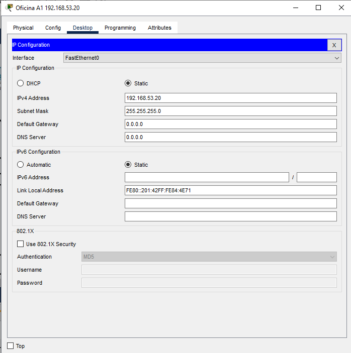

- VPC área de Ofcina B:
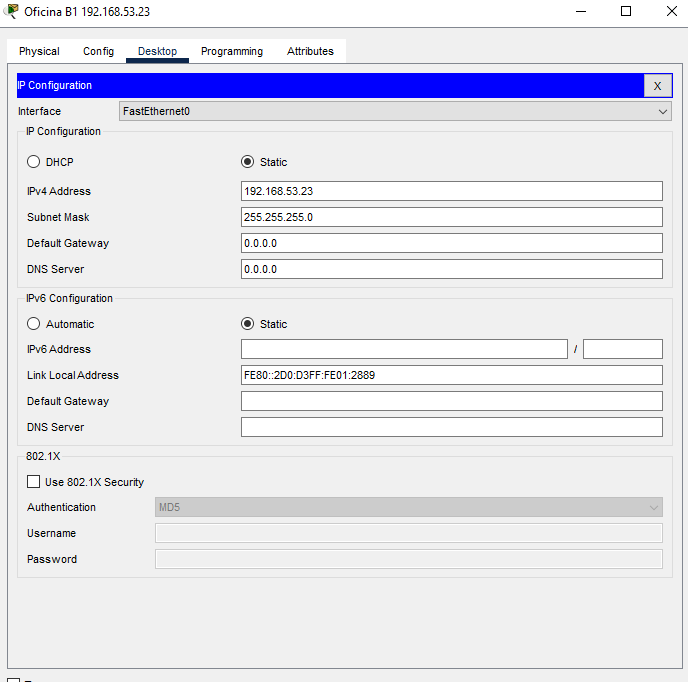

- VPC área de Ofcina C:
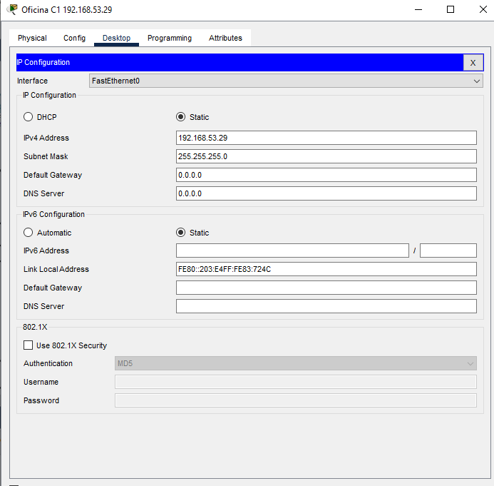

### 4. Verificación de comunicación entre las distintas areas
Para esta verificación abrimos el modo desktop de la computadora/VPC que queremos verificar, abrimos command prompt y aqui haremos un ping entre los host de la siguiente manera:
1. escribimos el comando`ping <direccion IP de la computadora/VPC a la que queremos verificar la comunicación>` y presionamos enter. 
2. Si la comunicación es exitosa se mostrara un mensaje de respuesta de la computadora/VPC a la que se le envio el ping.

a continuacion se muestran las capturas de pantalla de la verificación de comunicación entre las distintas areas:

- Verificación de comunicación entre RRHH 1 y Oficina A 1:
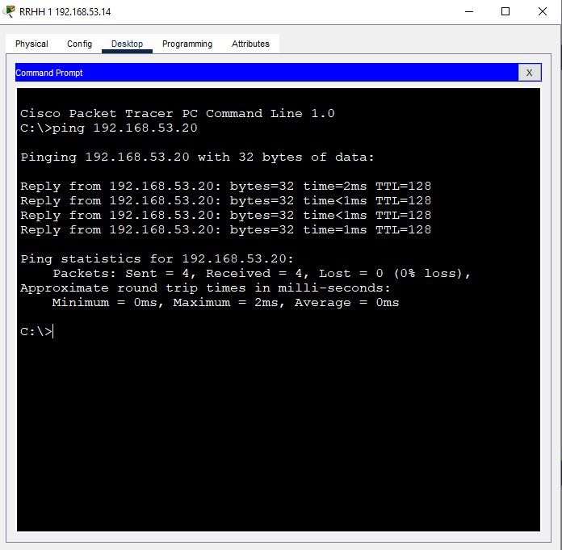

- Verificación de comunicación entre Admin y Oficina B 1:

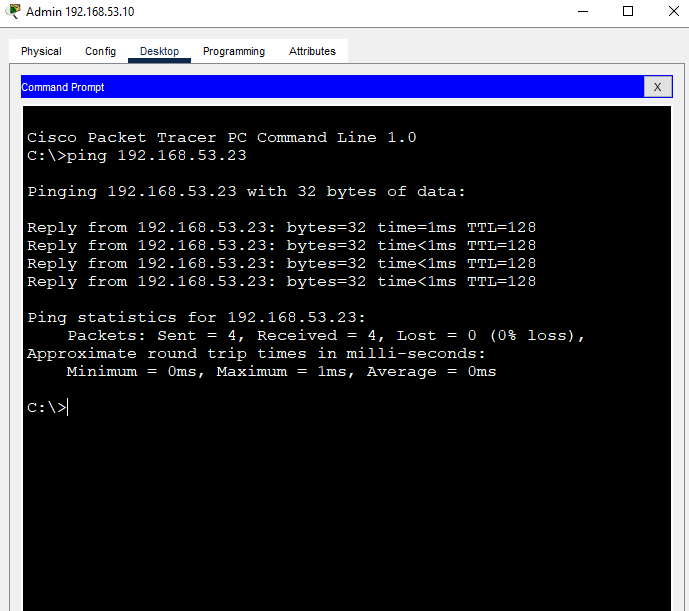

- Verificación de comunicación entre Oficina C 1 y atención al cliente 1:

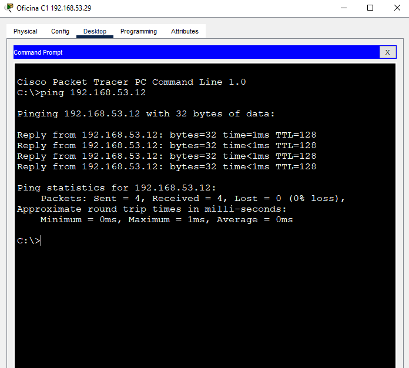

### 5. Envio de paquetes ARP/ICMP
Para esta verificación se utilizó la herramienta de simulación de paquetes de Cisco Packet Tracer, se envio un paquete ARP y un paquete ICMP  como se muestra en la siguiente imagen:

