# Manual Técnico


En este documento se detallan los pasos necesarios para la configuración de la red de la práctica 2. En la que se realizo una simulación de la topología de la red de la Academia Técnica de Formación Empresarial – TECAP que requiere de la comunicación entre dos sitios, incluyendo acceso a las redes privadas y redundancia de enlaces.

La topología de la red se muestra en la siguiente imagen:

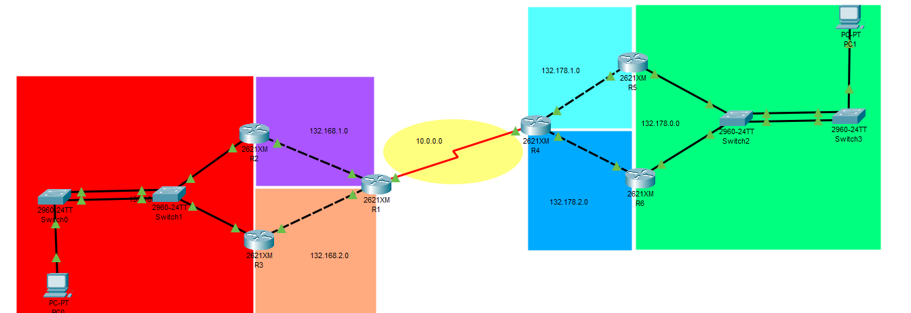

Para cumplir con los requerimientos de la práctica se realizaron las siguientes configuraciones:

## Configuración de routers

### Configuración de R1


Para la configuración de R1 se realizaron los siguientes pasos:

1. Se apago el router y se agrego un módulo WIC-2T para tener dos puertos seriales. Posteriormente se encendió el router para realizar la configuración.

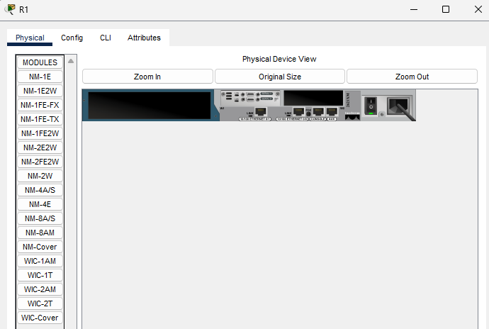


2. Se realizó la configuración básica del router, se le asigno un nombre con el comando `hostname R1` y se deshabilito la resolución de nombres de dominio con el comando `no ip domain-lookup`.

```bash
Router>enable
Router#conf t
Router(config)#hostname R1
R1(config)#no ip domain-lookup
R1(config)# do wr
```
3. Se configuraron las interfaces fa0/0, fa0/1 y la interfaz serial s0/0 con las direcciones IP correspondientes y se activaron las interfaces con el comando `no shutdown`.


```bash
R1(config)#int fa0/0
R1(config-if)#ip address 132.168.1.2 255.255.255.248
R1(config-if)#no shutdown
R1(config-if)#int fa0/1
R1(config-if)#ip address 132.168.2.2 255.255.255.248
R1(config-if)#no shutdown 
R1(config-if)#int s0/0
R1(config-if)#encapsulation ppp
R1(config-if)#clock rate 9600
R1(config-if)#ip address 10.0.0.1 255.255.255.252
R1(config-if)#no shutdown
R1(config-if)#do wr
R1(config-if)#exit
```

4. Se configuraron las rutas estáticas para la comunicación entre las redes de los VPCs y las redes de los routers. Para esto se siguio la tabla proporcionada en la práctica y la topología de la red.

```bash
R1(config)#ip route {red de destino} {mascara de red} {ip del siguiente salto}
```
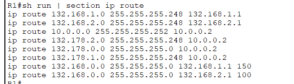

La configuración completa del router R1 se muestra en la siguiente imagen:

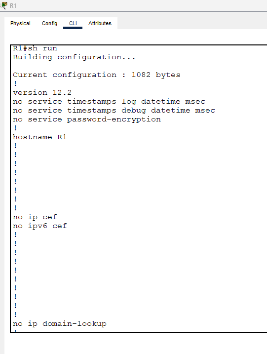

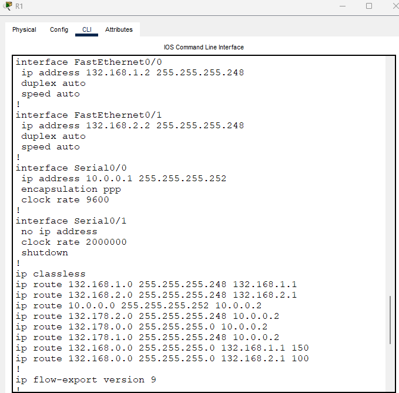

Se realizó una configuración similar para el Router R4 con las direcciones IP correspondientes.

### Configuración de R2

Para la configuración de R2 se realizaron los siguientes pasos:

1. Se realizó la configuración básica del router, se le asigno un nombre con el comando `hostname R2` y se deshabilito la resolución de nombres de dominio con el comando `no ip domain-lookup`.

```bash
Router>enable
Router#conf t
Router(config)#hostname R2
R2(config)#no ip domain-lookup
R2(config)# do wr
```
2. Se configuraron las interfaces fa0/0 y fa0/1 con las direcciones IP correspondientes y se activaron las interfaces con el comando `no shutdown`.

```bash
R2(config)#int fa0/0
R2(config-if)#ip address 132.168.1.1 255.255.255.248
R2(config-if)#no shutdown
R2(config-if)#int fa0/1
R2(config-if)#ip address 132.168.0.2 255.255.255.0
R2(config-if)#no shutdown
R2(config-if)#do wr
```
3. En la interfaz fa0/1 se configuró una interfaz virtual con la dirección IP correspondiente siguiendo el protocolo HSRP.

```bash
R2(config)#int fa0/1
R2(config-if)#standby 1 ip 132.168.0.1
R2(config-if)#standby 1 priority 110
R2(config-if)#standby 1 preempt
R2(config-if)#do wr
R2(config-if)#exit
```

4. Se configuraron las rutas estáticas para la comunicación entre las redes de los VPCs y las redes de los routers. 

```bash
R2(config)#ip route {red de destino} {mascara de red} {ip del siguiente salto}
```
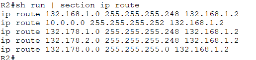

La configuración completa del router R2 se muestra en la siguiente imagen:

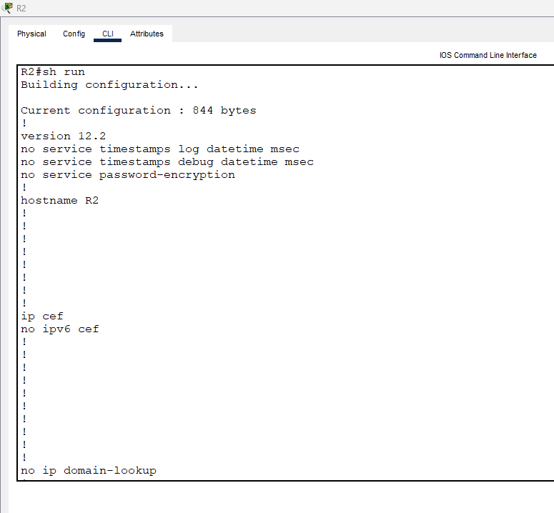

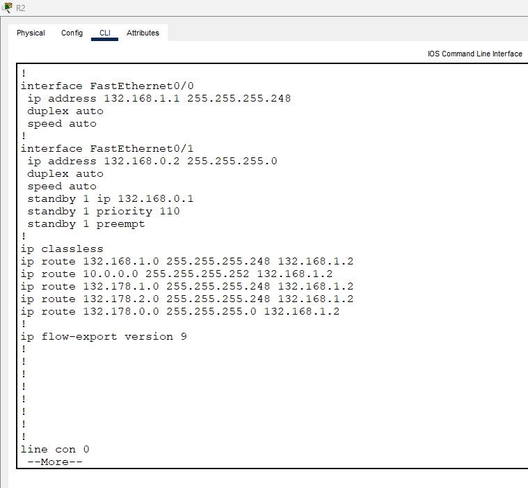

Se realizó una configuración similar para el Router R3 con las direcciones IP correspondientes. La configuración para el protocolo HSRP se realizó en la interfaz fa0/1 siguiendo el mismo procedimiento, pero no se configuro la prioridad ni el preempt, ya que se configuraron en el router R2 para que este sea el router activo.

### Configuración de R5

Para la configuración de R5 se realizaron los siguientes pasos:

1. Se realizó la configuración básica del router, se le asigno un nombre con el comando `hostname R5` y se deshabilito la resolución de nombres de dominio con el comando `no ip domain-lookup`.

```bash
Router>enable
Router#conf t
Router(config)#hostname R5
R5(config)#no ip domain-lookup
R5(config)# do wr
```

2. Se configuraron las interfaces fa0/0 y fa0/1 con las direcciones IP correspondientes y se activaron las interfaces con el comando `no shutdown`.

```bash
R5(config)#int fa0/0
R5(config-if)#ip address 132.178.1.2 255.255.255.248
R5(config-if)#no shutdown
R5(config-if)#int fa0/1
R5(config-if)#ip address 132.178.0.2 255.255.255.0
R5(config-if)#no shutdown
R5(config-if)#do wr
```

3. En la interfaz fa0/1 se configuró una interfaz virtual con la dirección IP correspondiente siguiendo el protocolo HSRP (originalmente era con GLBP pero en packet tracer no se puede configurar).

```bash
R5(config)#int fa0/1
R5(config-if)#standby 2 ip 132.178.0.1
R5(config-if)# do wr
R5(config-if)#exit
```

4. Se configuraron las rutas estáticas para la comunicación entre las redes de los VPCs y las redes de los routers. 

```bash
R5(config)#ip route {red de destino} {mascara de red} {ip del siguiente salto}
```
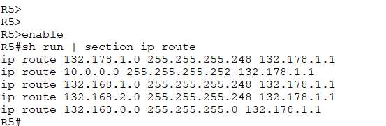

La configuración completa del router R5 se muestra en la siguiente imagen:

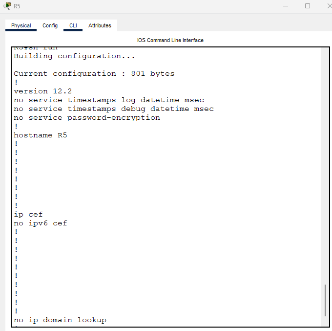

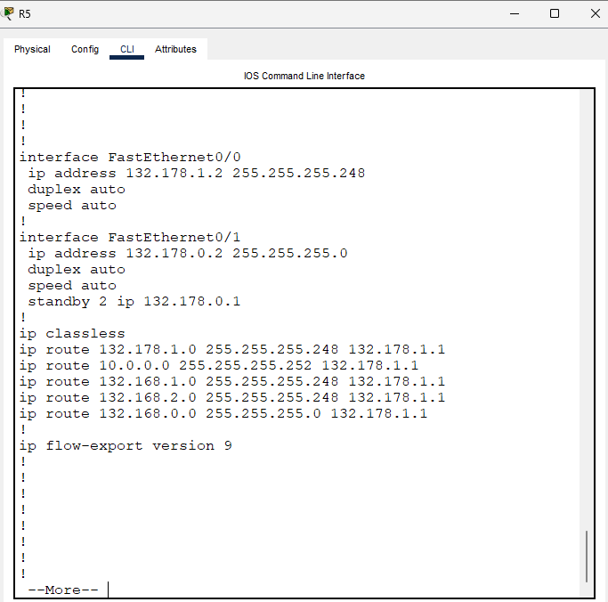

Se realizó una configuración similar para el Router R6 con las direcciones IP correspondientes. La configuración para el protocolo HSRP se realizó en la interfaz fa0/1 siguiendo el mismo procedimiento, pero en este se configuro la prioridad y el preempt (de manera similar al R2) ya que se configuraron en el router R5 para que este sea el router en espera.

## Configuración de Switches

En la topología de la red se tienen 4 switches, SW0, SW1, SW2 y SW3.

A todos los switches se les realizó la configuración básica, se les asigno un nombre con el comando `hostname` y se deshabilito la resolución de nombres de dominio con el comando `no ip domain-lookup`.

```bash
Switch>enable
Switch#conf t
Switch(config)#hostname SW0
SW0(config)#no ip domain-lookup
SW0(config)# do wr
```
Sin embargo, para la configuración de los switches SW0 y SW1 se realizó la configuración de un PortChannel con PAGP y para los switches SW2 y SW3 se realizó la configuración de un PortChannel con LACP.

### Configuración de SW0 y SW1

Para la configuración de SW0 y SW1 se utilizó el protocolo PAGP para la configuración del PortChannel, en las interfaces donde habia redundancia.

```bash	
SW0(config)#int range fa0/2 - 3
SW0(config-if-range)#channel-group 1 mode desirable
SW0(config-if-range)#do wr
SW0(config-if-range)#exit
```
Lo anterior también se realizó en el switch SW1.

La configuración completa del switch SW0 se muestra en la siguiente imagen:

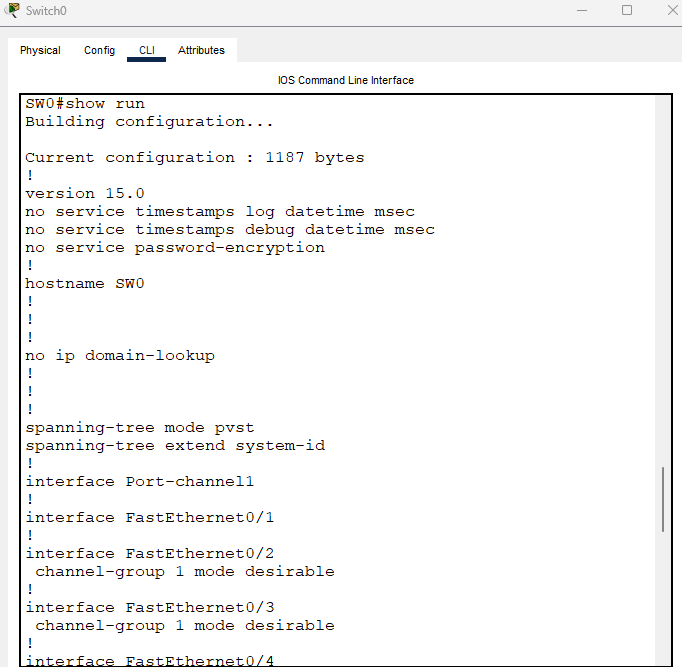

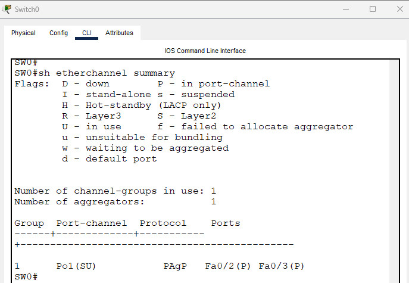

### Configuración de SW2 y SW3

Para la configuración de SW2 y SW3 se utilizó el protocolo LACP para la configuración del PortChannel, en las interfaces donde habia redundancia.

```bash
SW2(config)#int range fa0/2 - 3
SW2(config-if-range)#channel-group 1 mode active
SW2(config-if-range)#do wr
SW2(config-if-range)#exit
```
Lo anterior también se realizó en el switch SW3.

La configuración completa del switch SW2 se muestra en la siguiente imagen:

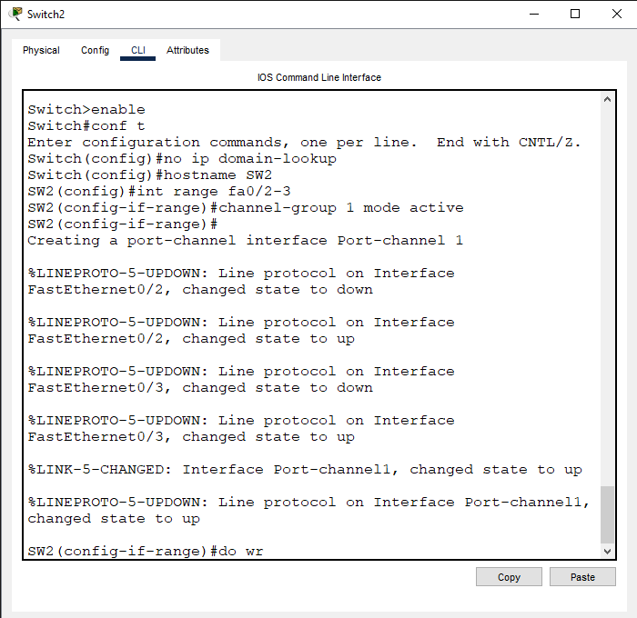

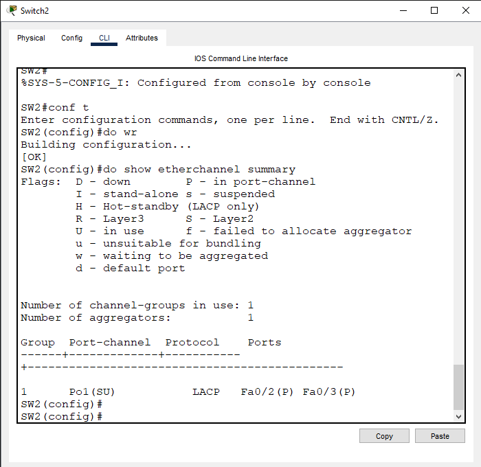

## Configuración de VPCs

Para la configuración de las VPCs no se requiere del uso de comandos, sin embargo, se asignaron las direcciones IP correspondientes a cada VPC siguiendo la tabla proporcionada en la práctica.

### Configuración de VPC1

Como se muestra en la siguiente imagen, la VPC1 tiene la dirección IP ` 132.168.0.4 ` con una mascara de red ` 255.255.255.0 ` y una puerta de enlace ` 132.168.0.1 ` la cual es la dirección IP virtual configurada en el router R2 y R3.

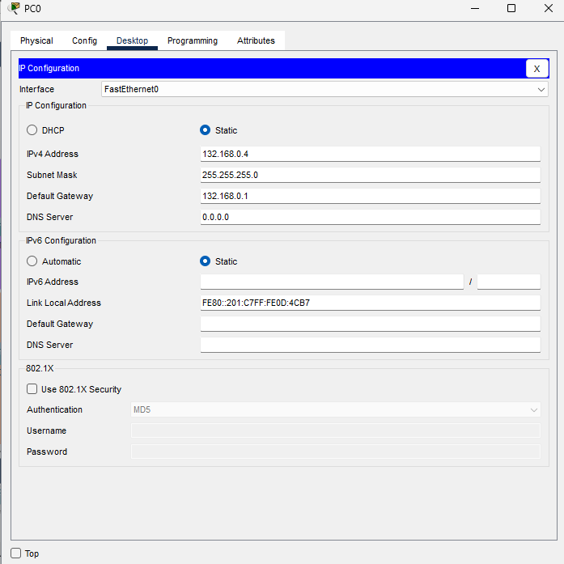

Esto se realizó de manera similar para las VPC2, con las direcciones correspondientes indicadas en la tabla de la práctica.

## Resumen de los comandos usados

A continuación se muestra un resumen de los comandos usados para la configuración de la red de la práctica 2 con su respectiva descripción.

### Creación de rutas estáticas

| Comando | Descripción |
| --- | --- |
| `ip route {red de destino} {mascara de red} {ip del siguiente salto}` | Permite la creación de una ruta estática en el router. La red de destino es la red a la que se quiere llegar, la mascara de red es la mascara de red de la red de destino y la ip del siguiente salto es la dirección IP del router por el cual se debe pasar para llegar a la red de destino. |

### Creación de PortChannel con PAGP y LACP

| Comando | Descripción |
| --- | --- |
| `int range fa0/x - y` | Permite seleccionar un rango de interfaces para realizar la configuración. x e y son los números de las interfaces. |
| `channel-group 1 mode desirable` | Permite la creación de un PortChannel con PAGP en el switch. El número 1 es el número del PortChannel y el modo desirable indica que el switch intentará formar un PortChannel con el otro switch con el protocolo PAGP. |
| `channel-group 1 mode active` | Permite la creación de un PortChannel con LACP en el switch. El número 1 es el número del PortChannel y el modo active indica que el switch intentará formar un PortChannel con el otro switch con el protocolo LACP. |
| `show etherchannel summary` | Permite ver los detalles del Portchannel configurado. |

### Creación de IP virtual con HSRP

| Comando | Descripción |
| --- | --- |
| `standby 1 ip {ip virtual}` | Permite la creación de una IP virtual en el router con el protocolo HSRP. El número 1 es el número del grupo de HSRP y la ip virtual es la dirección IP que se le asigna al grupo. |
| `standby 1 priority {prioridad}` | Permite la configuración de la prioridad en el router con el protocolo HSRP. El número 1 es el número del grupo de HSRP y la prioridad es el valor de prioridad que se le asigna al router. A mayor prioridad, mayor probabilidad de ser el router activo. |
| `standby 1 preempt` | Permite la configuración del preempt en el router con el protocolo HSRP. El número 1 es el número del grupo de HSRP. Para que un router sea el router activo, debe tener el preempt configurado, de lo contrario, será el router en espera. |
| `show standby` | Permite ver todos los detalles de la configuración del protocolo HSRP. |

### Configuración de VPC

Para la configuración de las VPCs no se requiere del uso de comandos. 

Pero para agregar las direcciones de ip y puerta de enlace se debe de abrir la opcion de ip configuration.

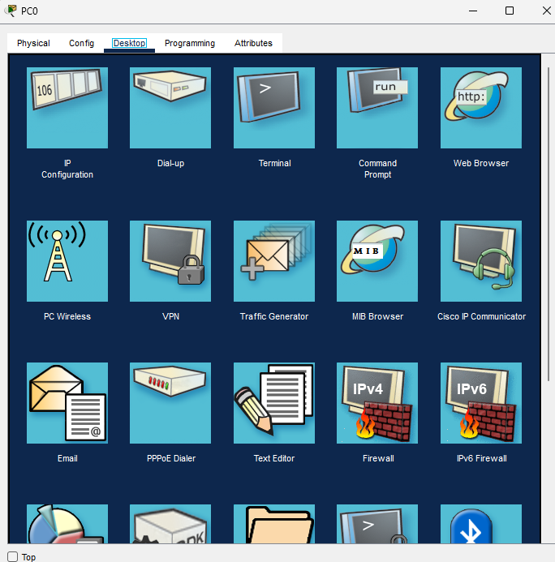


## Verificación de Funcionamiento

Tanto el protocolo de PortChannel con PAGP y LACP como la configuración de HSRP funcionan para crear redundancia en la red, de tal manera que si alguno de los dispositivos tiene algun problema, se tome otra ruta haciendo que la comunicación entre equipos no se vea afectada.

Por lo tanto se utilizaron dos maneras de comprobar el funcionamiento:

1. Enviando un paquete desde la VPC1 a la VPC2.

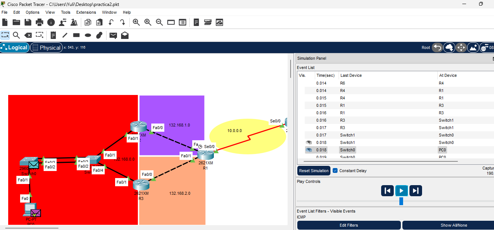

2. Haciendo un Ping extendido entre la VPC2 y la VPC2. Luego se fueron deshabilitando las interfaces de las rutas principales para comprobar que la conexion se reestablesca por la ruta secundaria.

    - Todos los routers activos:

    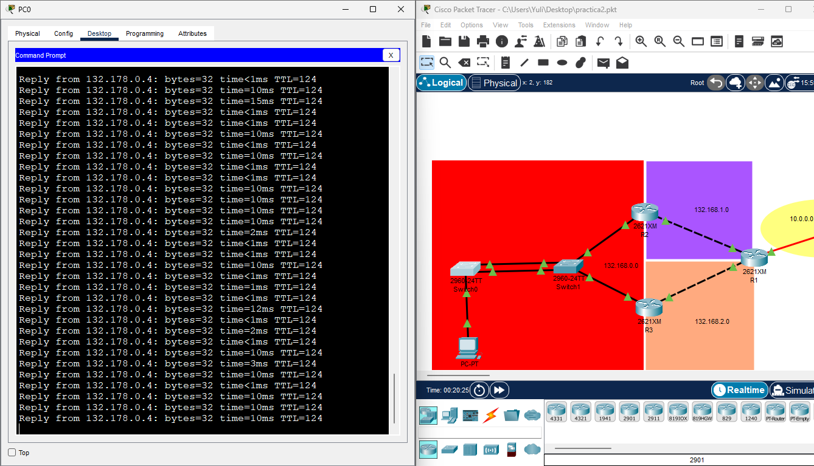

    - Deshabilitando la interfaz de fa0/2 de sw0:

    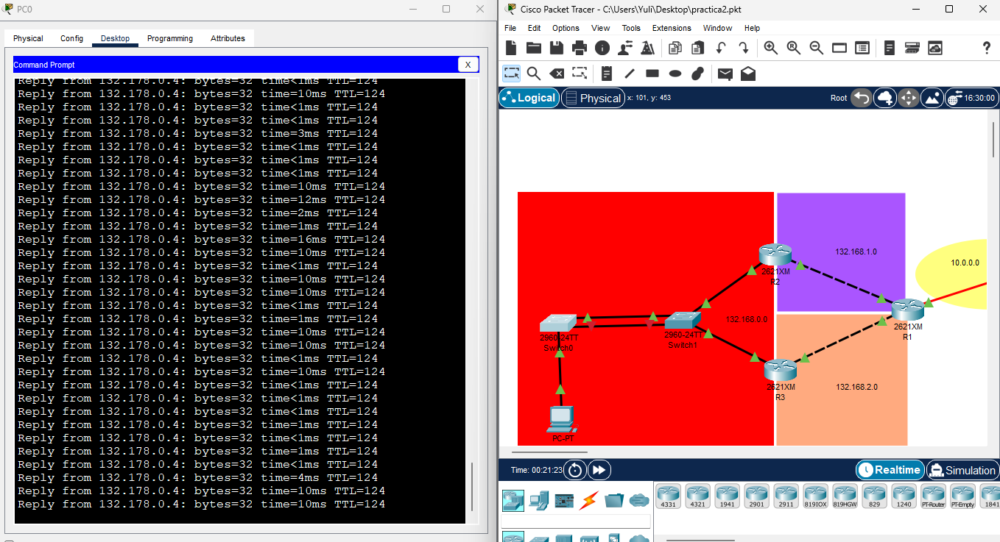

    - Deshabilitando la interfaz de fa0/0 de sw2:

    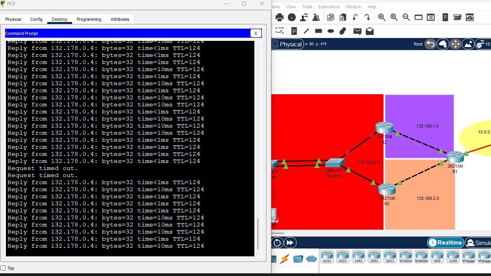

    


