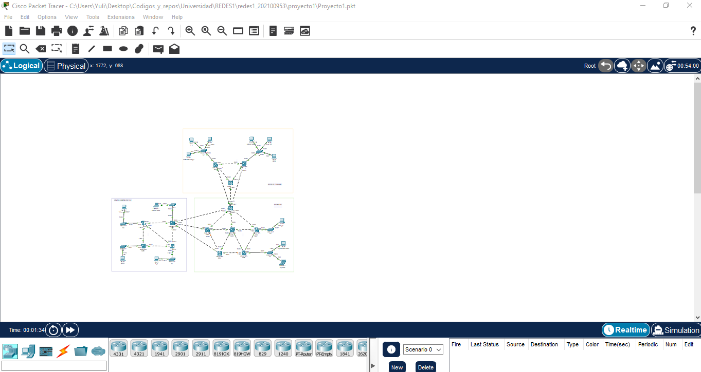
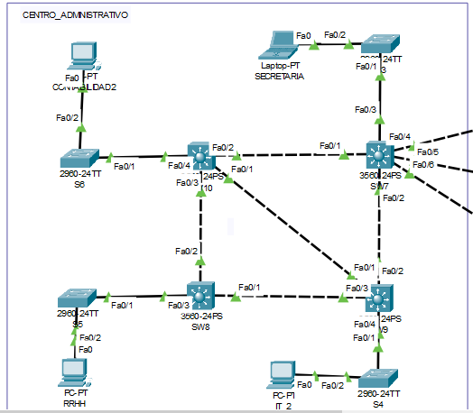
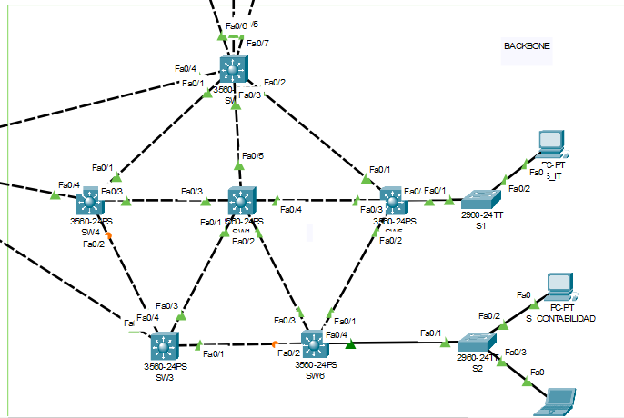
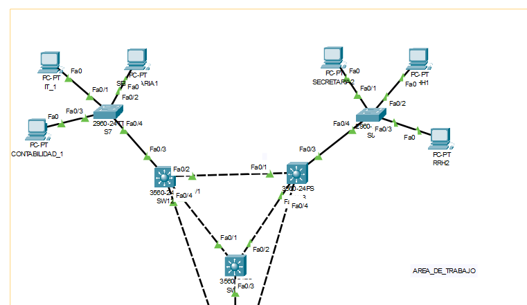
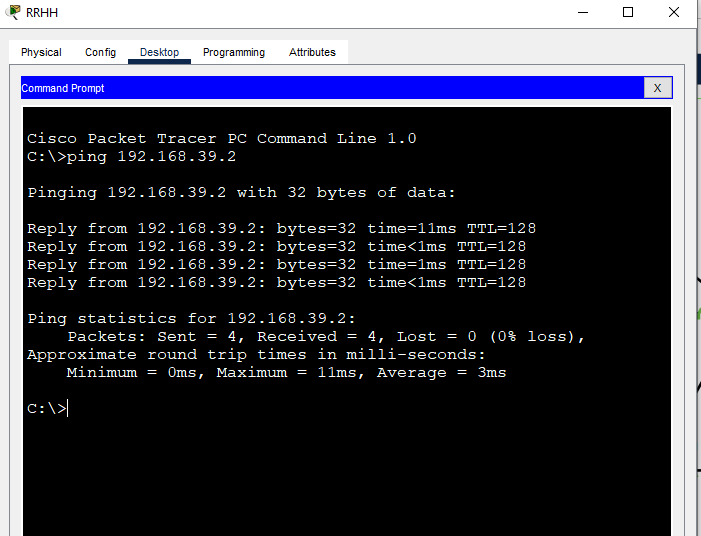
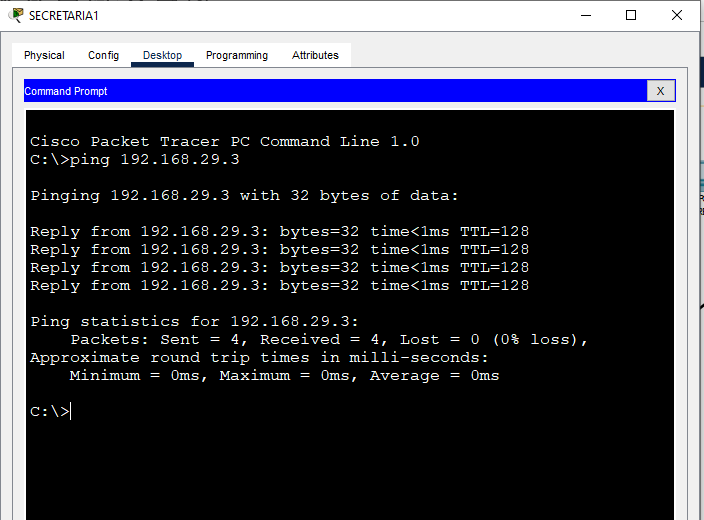

# Manual Técnico

## Resumen de direcciones IP y VLAN.

En la siguiente tabla se muestra la asignación de direcciones IP y VLAN para cada dispositivo de la topología.

| Dispositivo | VLAN | Dirección IP | Máscara de subred |
| ----------- | ---- | ------------ | ----------------- |
| S_CONTABILIDAD | 19 | 192.168.19.1 | 255.255.255.0 |
| CONTABILIDAD_1 | 19 | 192.168.19.2 | 255.255.255.0 |
| CONTABILIDAD2 | 19 | 192.168.19.3 | 255.255.255.0 |
| S_RRHH | 39 | 192.168.39.1 | 255.255.255.0 |
| RRHH1 | 39 | 192.168.39.2 | 255.255.255.0 |
| RRHH2 | 39 | 192.168.39.3 | 255.255.255.0 |
| RRHH | 39 | 192.168.39.4 | 255.255.255.0 |
| SECRETARIA | 29 | 192.168.29.1 | 255.255.255.0 |
| SECRETARIA1 | 29 | 192.168.29.2 | 255.255.255.0 |
| SECRETARIA2 | 29 | 192.168.29.3 | 255.255.255.0 |
| S_IT | 49 | 192.168.49.1 | 255.255.255.0 |
| IT_1 | 49 | 192.168.49.2 | 255.255.255.0 |
| IT_2 | 49 | 192.168.49.3 | 255.255.255.0 |

Como se puede observar, se han asignado direcciones IP de la forma 192.168.x.y, donde x es el número de VLAN y y es el número de dispositivo. Además, se ha asignado la máscara de subred. 

En resumen se han asignado 4 VLANs, para los distintos departamentos de la empresa, y se han asignado direcciones IP a los dispositivos de cada VLAN.

## Capturas de la implementación de la topología.
La topología implementada es la siguiente:

En imagen se tienen 3 areas, el primero es el centro administrativo, que contiene a RRHH y SECRETARIA, CONTABILIDAD2 e IT_2.

El segundo es el area de backbone, que contiene a S_IT, S_RRHH y S_CONTABILIDAD.
En esta area se encuentran el switch (SW1) que actua en modo servidor.

El tercero es el area de trabajo, que contiene a RRHH1, RRHH2, SECRETARIA1, SECRETARIA2, CONTABILIDAD1 e IT_1.

## Detalle de los comandos usados.
A continuación se detallan los comandos usados para la configuración de los dispositivos.

#### 1. Configuración inicial de todos los switches.

| Comando | Descripción |
| ------- | ----------- |
| `enable` | Permite entrar al modo privilegiado. |
| `configure terminal` | Permite entrar al modo de configuración global. |
| `hostname <nombre>` | Permite cambiar el nombre del dispositivo. |
| `no ip domain-lookup` | Permite deshabilitar la resolución de nombres de dominio. |
| `do write` | Permite guardar la configuración. |

#### 2. Configuración del Switch SW1.
Este es el switch que actua en modo servidor.

| Comando | Descripción |
| ------- | ----------- |
| `vtp version 2` | Permite configurar la versión 2 de VTP. |
| `vtp mode server` | Permite configurar el switch en modo servidor. |
| `vtp domain <nombre>` | Permite configurar el dominio VTP. |
| `vtp password <contraseña>` | Permite configurar la contraseña VTP. |
| `vlan <número>` | Permite crear una VLAN. |
| `name <nombre>` | Permite asignar un nombre a la VLAN. El comando anterior y este se repiten para todas las vlan a crear, en el caso de este proyecto seria para la 19,29,39 y 49 pertenecientes a Contabilida, Secretaria, RRHH e IT respectivamente |
| `interface range f0/1 - 5`| Permite seleccionar un rango de interfaces. El 5 es el numero de interfaces que se seleccionaran, en este caso se seleccionan las interfaces del 1 al 5, que son las que se conectan a los otros switches. |
| `switchport mode trunk` | Permite configurar las interfaces seleccionadas en modo troncal. |
| `switchport trunk encapsulation dot1q` | Permite configurar el encapsulamiento de las interfaces troncales. |
| `switchport trunk allowed vlan <número,número>` | Permite configurar las VLAN permitidas en las interfaces troncales. |
| `spanning-tree vlan <número> root primary` | Permite configurar el switch como raíz del árbol de expansión. Esto se repite para cada vlan creada. |
| `spanning-tree mode rapid-pvst` | Permite configurar el modo de spanning tree. |
| `do write` | Permite guardar la configuración. |

#### 3. Configuración de los switches clientes.

Los switches clientes seran todos los otros switches que no sean SW1, incluyendo a los switches 2960 que tambien se comunicaran con los dispositivos finales.

| Comando | Descripción |
| ------- | ----------- |
| `vtp version 2` | Permite configurar la versión 2 de VTP. |
| `vtp mode client` | Permite configurar el switch en modo cliente. |
| `vtp domain <nombre>` | Permite configurar el dominio VTP. Es el mismo dominio que el switch SW1. 
| `vtp password <contraseña>` | Permite configurar la contraseña VTP. |
| `interface range f0/1 - 5`| Permite seleccionar un rango de interfaces. El 5 es el numero de interfaces que se seleccionaran, en este caso se seleccionan las interfaces del 1 al 5, que son las que se conectan a los otros switches. |
| `switchport mode trunk` | Permite configurar las interfaces seleccionadas en modo troncal. |
| `switchport trunk encapsulation dot1q` | Permite configurar el encapsulamiento de las interfaces troncales. |
| `switchport trunk allowed vlan <número,número>` | Permite configurar las VLAN permitidas en las interfaces troncales. |
| `spanning-tree mode rapid-pvst` | Permite configurar el modo de spanning tree. |
| `do write` | Permite guardar la configuración. |

Para los switches 2960 que se conectan a los dispositivos finales, se debe configurar el modo de acceso en las interfaces que se conectan a los dispositivos finales de la siguiente manera:

| Comando | Descripción |
| ------- | ----------- |
| `interface f0/x`| Permite seleccionar una interfaz. x es el numero de la interfaz que se seleccionara. |
| `switchport mode access` | Permite configurar la interfaz en modo de acceso. |
| `switchport access vlan <número>` | Permite configurar la VLAN de acceso. |
| `access-list <número> denny ip <dirección> <máscara> <dirección> <máscara>` | Permite configurar una lista de acceso. En este caso se configura una lista de acceso que deniega el tráfico entre dos direcciones IP y se debe repetir para cada par de direcciones IP. |
| `do write` | Permite guardar la configuración. |

#### 4. Configuración de SW9 (Modo transparente).

El switch SW9 actua en modo transparente, por lo que la configuración es diferente a la de los switches clientes.

| Comando | Descripción |
| ------- | ----------- |
| `vtp mode transparent` | Permite configurar el switch en modo transparente. |
| `vtp domain <nombre>` | Permite configurar el dominio VTP. Es el mismo dominio que el switch SW1. |
| `vtp password <contraseña>` | Permite configurar la contraseña VTP. |

## Ping entre hosts.

1. Ping entre RRHH y RRHH1

2. Ping entre SECRETARIA1 y SECRETARIA2

