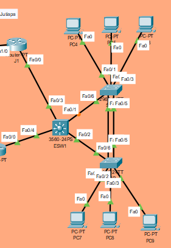
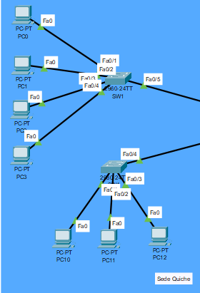
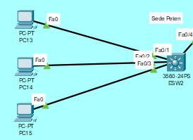
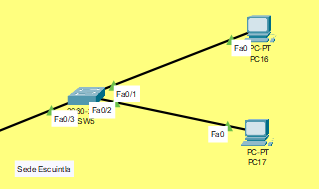
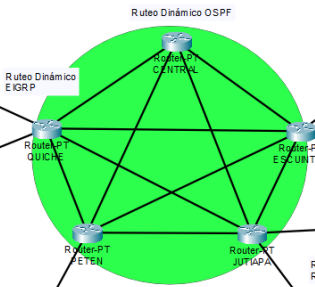

# Manual Técnico


En este documento se detallan los pasos necesarios para la configuración de la red del proyecto 2. En la que se realizo una simulación de la topología de red regional de la empresa de linea blanca y electrodomésticos, que cuenta con 4 sucursales, sede de Jutiapa, sede de Quiche, sede de Peten y sede de Escuintla.

## Direcciones IP y VLAN con VLSM

Para la configuración de la red se utilizo el método de VLSM, con el fin de optimizar el uso de direcciones IP y VLAN. A continuación se muestra la tabla de direcciones IP y VLAN utilizadas en la red.

1. **Sede de Jutiapa**

| VLAN | ID VLAN | EQUIPOS | No. HOST | MASCARA | WILDCARD | /SLAH | ID RED | PRIMERA IP | ULTIMA IP | BROADCAST |
|------|---------|---------|----------|---------|----------|-------|--------|------------|-----------|-----------|
| VENTAS | 39 | 25 | 30 |255.255.255.224|0.0.0.31|	/27|	192.168.93.0|	192.168.93.1|	192.168.93.30|	192.168.93.31|
| INFORMATICA | 49 | 12 | 14 |255.255.255.240 | 0.0.0.15 | /28 | 192.168.93.32 | 192.168.93.33 | 192.168.93.46 | 192.168.93.47 |
| RRHH | 19 | 10 | 14 | 255.255.255.240 | 0.0.0.15 | /28 | 192.168.93.48 | 192.168.93.49 | 192.168.93.62 | 192.168.93.63 |
| CONTABILIDAD | 29 | 4 | 6 |255.255.255.248 | 0.0.0.7 | /29 | 192.168.93.64 | 192.168.93.65 | 192.168.93.70 | 192.168.93.71 |

Para la elección de la máscara de subred se utilizo la máscara de subred que permitiera la cantidad de host necesarios para cada VLAN, de tal forma que se optimizara el uso de direcciones IP y VLAN.

Es por ello que se utilizo la máscara de subred /27 para la VLAN de ventas, ya que se necesitaban 25 equipos y la mascara de subred /27 permite 30 host. Para la VLAN de informática se utilizo la mascara de subred /28 ya que se necesitaban 12 equipos y la mascara de subred /28 permite 14 host. Para la VLAN de RRHH se utilizo la mascara de subred /28 ya que se necesitaban 10 equipos y la mascara de subred /28 permite 14 host. Para la VLAN de contabilidad se utilizo la mascara de subred /29 ya que se necesitaban 4 equipos y la mascara de subred /29 permite 6 host.

2. **Sede de Quiche**

| VLAN | ID VLAN | EQUIPOS | No. HOST | MASCARA | WILDCARD | /SLAH | ID RED | PRIMERA IP | ULTIMA IP | BROADCAST |
|------|---------|---------|----------|---------|----------|-------|--------|------------|-----------|-----------|
| VENTAS | 39 | 36 | 62 | 255.255.255.192 | 0.0.0.63 | /26 | 192.178.93.0 | 192.178.93.1 | 192.178.93.62 | 192.178.93.63 |
| INFORMATICA | 49 | 21 | 30 | 255.255.255.224 | 0.0.0.31 | /27 | 192.178.93.64 | 192.178.93.63 | 192.178.93.94 | 192.178.93.95 |
| RRHH | 19 | 12 | 14 | 255.255.255.240 | 0.0.0.15 | /28 | 192.178.93.96 | 192.178.93.97 | 192.178.93.110 | 192.178.93.111 |
| CONTABILIDAD | 29 | 10 | 14 |255.255.255.240 | 0.0.0.15 | /28 | 192.178.93.112 | 192.178.93.113 | 192.178.93.126 | 192.178.93.127 |

Para la elección de la máscara de subred se utilizo la máscara de subred que mejor se ajustara a la cantidad de host necesarios para cada VLAN, de tal forma que para la VLAN de ventas se utilizo la mascara de subred /26 ya que se necesitaban 36 equipos y la mascara de subred /26 permite 62 host. Para la VLAN de informática se utilizo la mascara de subred /27 ya que se necesitaban 21 equipos y la mascara de subred /27 permite 30 host. Para la VLAN de RRHH se utilizo la mascara de subred /28 ya que se necesitaban 12 equipos y la mascara de subred /28 permite 14 host. Para la VLAN de contabilidad se utilizo la mascara de subred /28 ya que se necesitaban 10 equipos y la mascara de subred /28 permite 14 host.

3. **Sede de Peten**

| VLAN | ID VLAN | EQUIPOS | No. HOST | MASCARA | WILDCARD | /SLAH | ID RED | PRIMERA IP | ULTIMA IP | BROADCAST |
|------|---------|---------|----------|---------|----------|-------|--------|------------|-----------|-----------|
| VENTAS | 39 | 30 | 30 |255.255.255.224 | 0.0.0.31 | /27 | 192.158.93.0 | 192.158.93.1 | 192.158.93.30 | 192.158.93.31 |
| INFORMATICA | 49 | 15 | 30 |255.255.255.224 | 0.0.0.31 | /27 | 192.158.93.32 | 192.158.93.33 | 192.158.93.62 | 192.158.93.63 |
| RRHH | 19 | 10 | 14 | 255.255.255.240 | 0.0.0.15 | /28 | 192.158.93.64 | 192.158.93.65 | 192.158.93.78 | 192.158.93.79 |

Para la elección de la máscara de subred se utilizo la máscara de subred que mejor se ajustara a la cantidad de host necesarios para cada VLAN, de tal forma que para la VLAN de ventas se utilizo la mascara de subred /27 ya que se necesitaban 30 equipos y la mascara de subred /27 permite 30 host. Para la VLAN de informática se utilizo la mascara de subred /27 ya que se necesitaban 15 equipos y la mascara de subred /27 permite 30 host. Para la VLAN de RRHH se utilizo la mascara de subred /28 ya que se necesitaban 10 equipos y la mascara de subred /28 permite 14 host.

4. **Sede de Escuintla**

| VLAN | ID VLAN | EQUIPOS | No. HOST | MASCARA | WILDCARD | /SLAH | ID RED | PRIMERA IP | ULTIMA IP | BROADCAST |
|------|---------|---------|----------|---------|----------|-------|--------|------------|-----------|-----------|
| VENTAS | 39 | 20 | 30 |255.255.255.224 | 0.0.0.31 | /27 | 192.148.93.0 | 192.148.93.1 | 192.148.93.30 | 192.148.93.31 |
| RRHH | 19 | 5 | 6 | 255.255.255.248 | 0.0.0.7 | /29 | 192.148.93.32 | 192.148.93.33 | 192.148.93.38 | 192.148.93.39 |

Para la elección de la máscara de subred se utilizo en la VLAN de ventas la /27 ya que se necesitaban 20 equipos y la mascara de subred /27 permite 30 host. Para la VLAN de RRHH se utilizo la mascara de subred /29 ya que se necesitaban 5 equipos y la mascara de subred /29 permite 6 host.

## Capturas de la implementación de las topologías

A continuación se muestran las capturas de la implementación de las topologías de red de la empresa de linea blanca y electrodomésticos.

1. **Sede de Jutiapa**



En esta sede a toda la red interna se le asigno el ID de red 192.168.93.0. Se aplico subnetting tomando en consideración la cantidad de equipos que se necesitaban para cada VLAN. Se asigno una IP a cada VPCS, se utilizo VTP para la propagación de las VLAN y RPVST para la prevención de bucles de red. Se configuro el protocolo LACP en SW2 y SW3. Para salir de la red interna de Jutiapa se utilizo los routers J1 y J2, los cuales usando HSRP proveerán una IP virtual 192.167.93.1 para la redundancia de primer salto.

Los routers J1 y J2 se conectaron a los switches SW1 y SW2 respectivamente utilizando las IP 192.167.93.2 y 192.167.93.3, para la comunicación entre el router JUTIAPA y los routers J1 y J2 se utilizo el ID de red 11.0.0.0/24, se utilizo VLSM para crear las subredes conforme sean necesarias.


2. **Sede de Quiche**



En esta sede a toda la red interna se le asigno el ID de red 192.178.93.0 Se aplico subnetting tomando en consideración la cantidad de equipos que se necesitaban para cada VLAN. Se asigno una IP a cada VPCS, y se utilizaron subinterfaces en el router Quiche para dar acceso a los equipos de la red interna de la empresa.

3. **Sede de Peten**



En esta sede a toda la red interna se le asigno el ID de red 192.158.93.0. Se aplico subnetting tomando en consideración la cantidad de equipos que se necesitaban para cada VLAN. Se asigno una IP a cada VPCS, se utilizo VTP para la propagación de las VLAN y RPVST para la prevención de bucles de red. Se configuraron interfaces virtuales para la puerta de enlace predeterminada de cada VLAN en el ESW2. 


4. **Sede de Escuintla**



En esta sede a toda la red interna se le asigno el ID de red 192.148.93.0 Se aplico subnetting tomando en consideración la cantidad de equipos que se necesitaban para cada VLAN. Se asigno una IP a cada VPCS, se utilizo VTP para la propagación de las VLAN y RPVST para la prevención de bucles de red.

5. **Central**



En la central a toda la red interna se le asigno el ID de red 10.0.0.0  y en este caso se empleo FLSM para la configuración de las subredes. Tambien se hizo uso del protocolo de ruteo dinámico OSPF para la comunicación del Router Central hacia los demás router, Ruteo dinámico EIGRP para Sede Quiche y Peten y ruteo dinámico RIP para Sede Jutiapa y Escuintla.

## Detalle de todos los comandos usados


### Configuración de la sede de Jutiapa

Para la configuración de la sede de Jutiapa se utilizo el siguiente script.

```bash
enable
configure terminal
hostname JUTIAPA
interface GigabitEthernet0/0
ip address
no shutdown
exit
```

### Configuración de la sede de Quiche

Para la configuración de la sede de Quiche se utilizo el siguiente script.

```bash
enable
configure terminal
hostname QUICHE
interface GigabitEthernet0/0
ip address
no shutdown
exit
```

### Configuración de la sede de Peten

Para la configuración de la sede de Peten se utilizo el siguiente script.

```bash
enable
configure terminal
hostname PETEN
interface GigabitEthernet0/0
ip address
no shutdown
exit
```

### Configuración de la sede de Escuintla

Para la configuración de la sede de Escuintla se utilizo el siguiente script.

```bash

enable
configure terminal
hostname ESCUINTLA
interface GigabitEthernet0/0
ip address
no shutdown
exit
```

### Configuración de la central

Para la configuración de la central se utilizo el siguiente script.

```bash
enable
configure terminal
hostname CENTRAL
interface GigabitEthernet0/0
ip address
no shutdown
exit
```


